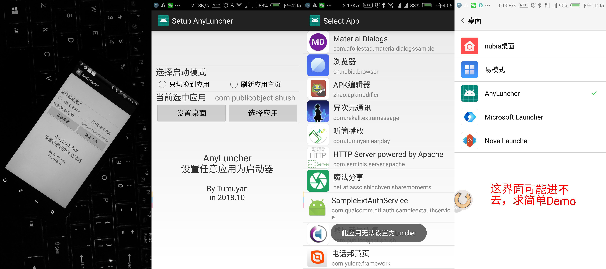
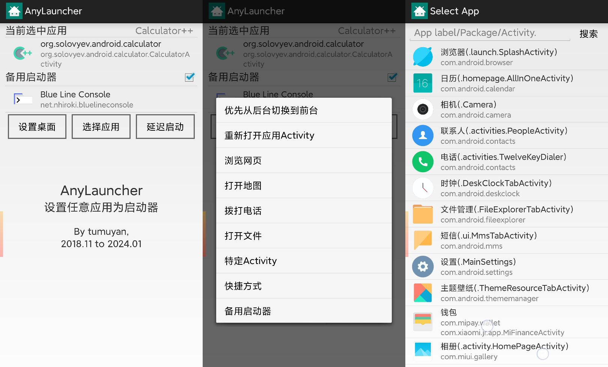

# AnyLauncher
You can choose any Android application and set it as a Launcher.

## Download | 下载
[Github Release](https://github.com/tumuyan/AnyLauncher/releases)

## About | 关于
  
  
  
可以选择任意一个应用把他设置为Launcher.
似乎并没有什么卵用？
如果你把一台安卓设备当成专用机（电子相册、电子菜单、手持终端），使用AnyLauncher就可以一定程度屏蔽home键，让用户哪怕误操作跳到其他应用中后，一按home又回来了。
当然如果你花钱订制了专用机的软硬件，这样的功能应该有了吧 吧 吧 吧 吧。

有两个工作模式：
1. 按下Home键，启动指定应用
2. 连续快速按下三次Home键，启动备用启动器

工作模式1又有多种设置模式： 
1. 每次按下home键，都重新打开选中的应用的默认Activity；
2. 每次按下home键，把选中的应用切换到前台
3. 打开指定网页、地图、电话拨号、应用的具体Activity、快捷方式等

目前无法保证能跳转到系统默认Launcher选择器的界面，百度到的方法似乎都不怎么好用。如果有简单的demo请联系我

## Build Environment
* Android Gradle Plugin 3.2.1
* Gradle 4.6
* Oracle OpenJDK 1.8